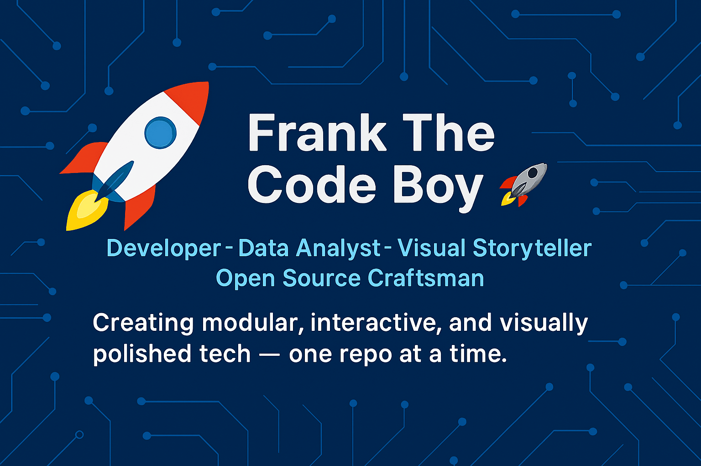

  

<h1 align="center">Frank The Code Boy 🚀</h1>

  <em>Developer • Data Analyst • Visual Storyteller • Open Source Craftsman</em> 
  <strong>Building modular, interactive, and visually polished tech — one repo at a time.</strong>

  

---

## 🧠 Who Am I?

Hi, I'm **Frank**, a full-stack developer and data analyst blending code with clarity. Whether it's scripting smart Python tools, visualizing data with Plotly & GeoJSON, or crafting modular games with Pygame — I build projects that speak for themselves.

I believe in:
- 📦 Clean, documented, license-compliant repos  
- 📊 Data that tells stories  
- 🎮 Games that teach or entertain  
- 🌐 Web apps that feel alive  
- 🛠️ Iterative improvement and discoverability  

---

## 🧰 Tech Stack

---

## 🏅 Certifications

  
  
  

  <a href="https://github.com/frankTheCodeBoy/DataScience_Capstone">🔗 IBM Data Science Capstone</a> • 
  <a href="https://github.com/frankTheCodeBoy/Security_and_Auth_Microsoft_Capstone_Project_2025">🔗 Microsoft Security & Auth Capstone</a>

---

## 🌟 Featured Projects

### 🔍 [DataScience_Capstone](https://github.com/frankTheCodeBoy/DataScience_Capstone)
A complete end-to-end data science project showcasing your skills in data wrangling, visualization, and predictive modeling.  
**Tech:** Python, Pandas, Matplotlib, Scikit-learn, Jupyter  
📜 Final capstone for IBM & Google certifications.

---

### 🧠 [ML_Clustering_Project](https://github.com/frankTheCodeBoy/Data_Science_Machine_Learning_Analysis)
Unsupervised learning project using clustering algorithms to uncover hidden patterns in real-world datasets.  
**Tech:** Python, Scikit-learn, Seaborn, GeoJSON  
📊 Includes interactive visualizations and mapping.

---

### 🎮 [Pygame_Space_Shooter](https://github.com/frankTheCodeBoy/Pygame_game_Development)
A modular arcade-style space shooter game built with Pygame.  
**Tech:** Python, Pygame  
🕹️ Replayable, customizable, and fun to dissect.

---

### 🌐 [Security_and_Auth_Microsoft_Capstone_Project_2025](https://github.com/frankTheCodeBoy/Security_and_Auth_Microsoft_Capstone_Project_2025)
Full-stack web app focused on secure authentication and user management.  
**Tech:** C#, Blazor, ASP.NET, Entity Framework  
🔐 Final capstone for Microsoft Full-Stack Developer Certificate.

---

### 📊 [GeoJSON_Visualizer](https://github.com/frankTheCodeBoy/Realtime_API_Data_And_Earthquakes_Visualisation)
Interactive map-based data visualizer using GeoJSON and Plotly.  
**Tech:** Python, Plotly, GeoJSON  
🌍 Spatial data storytelling and dashboards.

---

## 🕰️ Timeline of Growth

- **2023**: Started building modular Python scripts and automation tools  
- **Q2 2023**: Created interactive games with Pygame and began exploring data visualization  
- **Q3 2023**: Earned Google Data Analytics Professional Certificate  
- **Q4 2023**: Completed IBM Data Science Professional Certificate  
- **Q1 2024**: Built dashboards and GeoJSON visualizers for spatial data  
- **Q2 2024**: Upgraded GitHub profile with dynamic stats, badges, and infographics  
- **Q3 2024**: Earned Microsoft Full-Stack Developer Certificate (Security & Auth)  
- **2025**: Refined portfolio, documentation, and repo presentation for discoverability  

---

## 📈 GitHub Stats & Engagement

  
  

  

---

## 🧭 Future Direction

This repo (`frankthecodeboy.github.io`) is currently reserved for a **future portfolio site** — one that will be:
- ✨ Visually striking  
- 📚 Technically rich  
- 🧩 Modular and interactive  
- 🌐 Discoverable and recruiter-friendly  

Until then, this README acts as a **living preview** of what’s to come.

---

## 🌐 External Portfolio

You can explore my current portfolio site here:  
🔗 [OlumPortfolio.pythonanywhere.com](https://OlumPortfolio.pythonanywhere.com)

---

## 📬 Contact Me

- 📧 Email: `Olumfrank48@gmail.com`  
- 📱 Tel: `+254 734 633 607`

---

## ⚖️ License

This repository is licensed under the [MIT License](LICENSE).  
Feel free to fork, adapt, and build upon it — just give credit where it's due.

---

> _“Code is craft. Data is narrative. Presentation is everything.”_  
> — Frank The Code Boy
